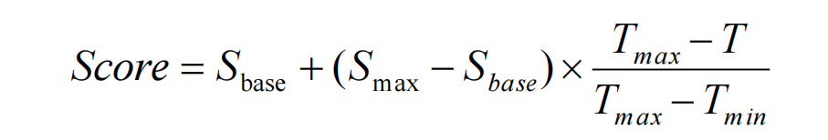
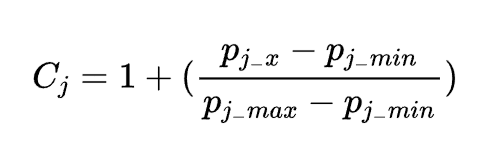
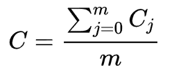
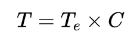

# 队伍：永远享受兜风的感觉
# rank: top1
## 赛题名称：AI 最短推理时延
## 赛题描述：
在满足硬件资源约束和执行依赖的前提下，为给定的 AI 推理任务（以计算图形式呈现）选择合适的 tiling 策略，并为每个子图节点分配核资源与执行时间，最终使所有子图节点中最晚节束的时间（即推理时延）最短。
***
## 得分函数:
## 初赛：最小化makespan(最后一个计算节点的结束时间)

## 决赛：引入功耗概念（通俗意思就是整个计算图的执行时间），对时延进行罚时
## 算子选择某个tiling下的罚时系数（某个子图）

## 总计算图的惩罚系数

## 最终时延

***
## 解题思路
题目简化后的问题就是如何调度计算图中的计算节点，事实上就是一种jsp问题的变种，考虑到是np-hard问题以及对于赛题测试用例的观察后摒弃使用精确解法，而使用贪心+启发式的方式来解决该问题。
## 调度策略：
调度某个计算节点的时候，需要考虑到该节点的最早开始时间，后续依赖节点的数量以及后续节点形成调度链的可能的节点时间等因素。综合三个因素，设计了一种优先级评分函数构造形式如下：
```
constexpr ull startFactor, timeFactor, numberFactor;
double priority = ( 1.0 * startFactor * succStart - 1.0 * timeFactor * (timelines[node] + numberFactor * allNodes[node].successors.size()));
```
代码中的timelines是用来预估某节点调度链的价值，具体含义是调度某节点之后的所有节点中的最迟的节点结束时间，用该时间来评估某节点的调度链价值。做法也比较简单，用逆拓扑排序颠倒后继节点和前驱结点，在无资源限制的情况下计算出所有结点的调度链价值即可，其余几个Factor是参数可以调节。

## 核选择策略
在选择核的时候根据当前节点的最早开始时间遍历所有同类型下的核，选择最早可以插入的核即可，这里为了降低复杂度可以用区间合并的方法去维护每个核的执行区间，并且在选择某个核的时候一般只需要扫描这个核的最后几个区间就行（因为存在节点依赖和内存限制问题，基本上节点的执行时间落在后几个区间中）。事实上我对所有的测试用例进行评估后发现，直接插入到最后一个区间的后面影响并不大。

## 引入强制优先级预防调度失败问题
在上述设计的优先级评分函数中，未考虑到同类型影响问题，为了解决某些用例内存限制的极限问题，对优先级评分函数做了如下修改：
```
pair<int, double> priority = make_pair(flag, ( 1.0 * startFactor * succStart - 1.0 * timeFactor * (timelines[node] + numberFactor * allNodes[node].successors.size())));
```
引入强制调度标签flag，来改变调度优先级问题，这样做的好处是可以在很大程度上调度内存约束严重的节点，保证后续节点能够成功调度。
## 引入节点锁机制解决调度失败问题
在调度过程中会出现当前节点无法调度的问题，我们可以创建一个队列，将该节点加入到由于哪种内存类型引起失败的队列中，在每次关于改内存的释放后，去判断是否满足队列中节点的调度要求，重新释放回调度序列中。

## tiling选择策略：
在选择的时候可以贪心的考虑以下几种方案：某个算子的tiling集合中:子图的结点数量最小;子图在无资源限制的情况下调度结束时间最早;子图在所有tiling选择中执行时间最短（决赛加入）。
## 启发式选择策略：
在根据贪心得到最优的选择策略后，每次迭代随机保留一部分算子的tiling，随机重置一部分算子的tiling,重置的tiling的选择可以来源于贪心的方案中也可以来源于纯随机。我的概率选择方案如下：
```
// 结合算子的总数来做调整，可以让爬山算法更加高效
double probability = rng.next(2) == 1 ? 1.0 / (5 * sqrt(graph.opInfo.size())) : 0.01;
```
## 内存限制问题
整个赛题中这个问题是最难解决的，并且该问题也很大程度上影响到了某个测试用例能不能调度出可行解。其实我们可以使用分类的思想来维护内存，具体可以分为三类：内存库中原始的内存，节点使用后受时间约束的内存，节点使用后受同类型约束的内存。在调度某节点的时候，先去寻找内存库中原始的内存是否满足调度需求，若不满足则在时间约束的内存和同类型约束的内存中寻找。具体的对于时间约束的内存，我们仍然可以维护一个有序集合（对某类型来说），该集合保存的是每个节点调度后使用某类型内存的时间区间，并且我们按照区间的右端点来维护这个集合。当调度某节点时间我们按照顺序逐渐回收内存即可。对于受同类型约束的内存来说，这部分内存事实上只有与父节点内存类型相同的最后一个调度的子节点来使用，所以在使用这部分内存的时候，需要注意到该节点是不是最后一个调度的即可。三种类型内存的优先级调度顺序为：原始内存->同类型约束内存->时间约束内存


## 决赛对于初赛的改动
由于时间问题，我只修改了在启发的时候的得分函数（加入了惩罚系数）

### 后续可优化的地方：
由于我在线上的20个用例全部通过，所以我简单的认为线下的测试用例用我当前的调度策略也能通过，但是事实上在线上我出现了两个用例无法通过的问题。在赛后能我也对我的代码进行反思和总结，认为在调度策略中强制调度标签的引入过于简单，将该标签改为与内存百分比约束有关的表征可能更加高效
```
                   // 记录最大的内存占有率
                    double occupy = 0.0;
                    for (int i = 0; i < MAX_MEMORY; ++ i) {
                        if ( pVector[i] != 0 && sonVector[i] != 0) {
                            occupy = max((1.0 * lockOfSum[i] + sonVector[i]) / orginalMemory[i], occupy);
                        }
                    }
                    if (occupy > Threshold) {
                        // 这里的flag设计过于简单
                        flag = resetStartFlag;
                    }
```
那么将修改后更加高效的flag融于初始优先级函数中，这样更加全面考虑到调度时延+内存约束等问题。
